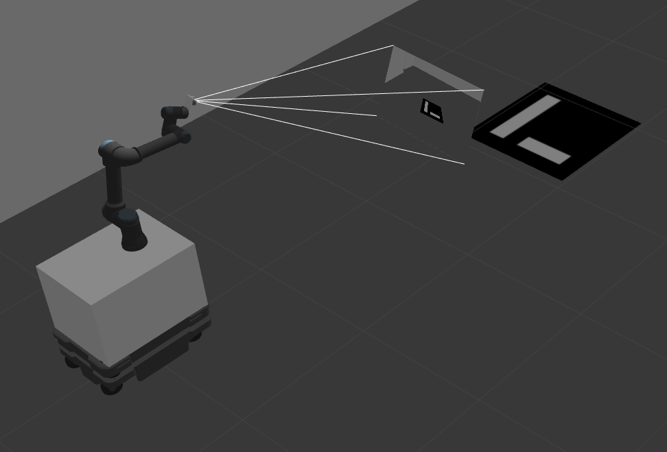

# mobile_manipulator
This is a ROS2 package for MiR 250 + UR5e + Realsense D435i with ros2_control, Gazebo and Ignition Gazebo simulation.




# Installation

## Preliminaries
## ROS2
If you haven't already installed [ROS2](https://docs.ros.org/en/humble/Installation/Ubuntu-Install-Debians.html) on your PC, you need to add the ROS2 apt repository.

Also install ros2-control and ros2-controllers

```
sudo apt-get install ros-humble-ros2-control
sudo apt-get install ros-humble-ros2-controllers
```
## Source install
```
# create a ros2 workspace
mkdir -p ~/ros2_ws/src
cd ~/ros2_ws/

# clone mir_robot into the ros2 workspace
git clone https://github.com/Spartan-Velanjeri/UR-MiR-mobile-manipulator.git src/mir_robot

# use vcs to fetch linked repos
# $ sudo apt install python3-vcstool
vcs import < src/mir_robot/mir_robot/ros2.repos src --recursive

# use rosdep to install all dependencies (including ROS itself)
sudo apt update
sudo apt install -y python3-rosdep
rosdep update --rosdistro=humble
rosdep install --from-paths src --ignore-src -r -y --rosdistro humble

# build all packages in the workspace
source /opt/ros/humble/setup.bash
cd ~/ros2_ws
colcon build
```
You must source the workspace in each terminal you want to work in:
```
source ~/ros2_ws/install/setup.bash
```
Also make sure to run this in order to avoid problems with Gazebo (SEE NOTES)
```
. /usr/share/gazebo/setup.sh
```

# Gazebo demo (mapping)
```
### gazebo: 
ros2 launch mir_gazebo mobile_manipulator.launch.py world:=maze

### mapping (slam_toolbox)
ros2 launch mir_navigation mapping.py use_sim_time:=true slam_params_file:=$(ros2 pkg prefix mir_navigation)/share/mir_navigation/config/mir_mapping_async_sim.yaml

### navigation (optional)
ros2 launch mir_navigation navigation.py use_sim_time:=true cmd_vel_w_prefix:=/diff_cont/cmd_vel_unstamped
```

# Gazebo demo (Navigation with existing map)
```
### gazebo:
ros2 launch mir_gazebo mobile_manipulator.launch.py world:=maze rviz_config_file:=$(ros2 pkg prefix mir_navigation)/share/mir_navigation/rviz/mir_nav.rviz


### localization (existing map)
ros2 launch mir_navigation amcl.py use_sim_time:=true map:=$(ros2 pkg prefix mir_navigation)/share/mir_navigation/maps/maze.yaml

### navigation
ros2 launch mir_navigation navigation.py use_sim_time:=true
```

# Manipulation using MoveIt2
```
### gazebo:
ros2 launch mir_gazebo mobile_manipulator.launch.py world:=maze

### MoveIt2:
ros2 launch ur_moveit_config ur_moveit.launch.py ur_type:=ur5e launch_rviz:=true prefix:=ur_ use_fake_hardware:=true use_sim_time:=true

### Gazebo Aruco model path (Also put in the src/mir_robot/mir_gazebo/worlds/include folder)
/install/mir_gazebo/share/mir_gazebo/worlds/include/marker_0001

### Aruco tag recognition (Make sure to add camera img to Rviz before running this)
ros2 launch ros2_aruco aruco_recognition.launch.py

### Aruco pose to nav2 goal
ros2 run ros2_aruco aruco_pose_to_nav_goal

### Aruco pose to manipulator goal
ros2 run ros2_aruco aruco_pose_to_manipulate

### Origin pose to nav2 goal
./src/mir_robot/mir_navigation/nav2_test.py 

### Tranform aruco pose to ur_base_link
ros2 run ros2_aruco aruco_pose_to_moveit

### hello_ur_moveit
ros2 launch hello_moveit_ur hello_moveit_ur_launch.py 


```
# Notes

1. If you get an error with respect to Gazebo Classic: Cannot launch gzclient on a launch file - results in shared_ptr assertion error, 

    All you have to do is, source the gazebo classic by`. /usr/share/gazebo/setup.sh`
    and try again

2. If you encounter an error with respect to launching the ur_moveit launch:  Exception caught while processing action 'loadRobotModel': parameter 'robot_description_planning.joint_limits.panda_joint1.max_velocity' has invalid type: Wrong parameter type, parameter {robot_description_planning.joint_limits.panda_joint1.max_velocity} is of type {double}, setting it to {string} is not allowed,

    All you have to do is set `LC_NUMERIC=en_US.UTF-8` in your terminal and try again

3. If you get an error about gazebo already open elsewhere, run this -

    `killall gzserver `
    
## Acknowledgement

The 3d files for MiR 250 is from [DFKI](https://github.com/DFKI-NI/mir_robot).
The 3d model and plugins for UR5e are from [Universal_Robots_ROS2_Driver](https://github.com/UniversalRobots/Universal_Robots_ROS2_Driver).
The Realsense plugin is from [PAL Robotics](https://github.com/pal-robotics/realsense_gazebo_plugin/tree/foxy-devel) and description from [Intel](https://github.com/IntelRealSense/realsense-ros).


